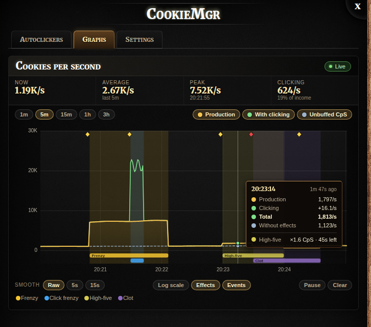
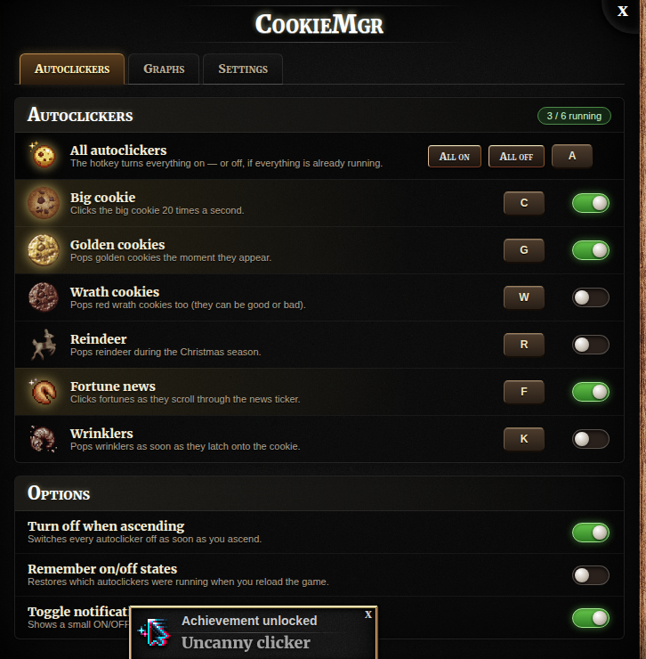

# CookieMgr

_(Previously called Cookie Agent.)_

A [Cookie Clicker](https://orteil.dashnet.org/cookieclicker/) add-on for automating tasks and visualizing data.
It loads like [Cookie Monster](https://github.com/CookieMonsterTeam/CookieMonster): a one-line bookmarklet pulls the
latest build from GitHub Pages, so pushing to this repo updates everyone's add-on.

## Terminology

The same words mean the same things everywhere in the add-on and this README:

| Term       | Meaning                                                                                 |
| ---------- | --------------------------------------------------------------------------------------- |
| **Page**   | A top-level section of CookieMgr, one per icon in the sidebar (e.g. Graphs).            |
| **Tab**    | A sub-section inside a page.                                                            |
| **Action**    | One thing CookieMgr can do in the game, once (click the big cookie, pop golden cookies, …). |
| **Macro**     | An automation made of one or more actions: on a repeat, when a condition holds, or once. |
| **Condition** | Something a macro can wait for (an effect is active, a value crosses a line, …).       |
| **Hotkey**    | A key combination bound to one or more macros. hotkey → macro(s) → action(s).          |
| **Event**  | Something that happened in the game (a golden cookie popped, a stock was sold, …).      |
| **State**  | A value that can be measured over time (cookies in the bank, CpS, …).                   |
| **Frame**  | One recorded sample of every state at a moment (or, for older history, a merged span).   |
| **Widget** | A small box on the game's left panel (shortcuts, Running now, quick stats, latest events). |

## Features (v2.2)

A column of small icons sticks out of the left beam just below the game's cookie counter, one per page:
**Macros**, **Graphs**, **Events**, **Stock market**, **Wizard tower**, **Widgets** and **Settings**. Hovering an icon slides its name out to the left.
Clicking one opens the CookieMgr panel straight to that page (switching pages directly if it's already open on a
different one); clicking the page that's already showing closes the panel.



### Graphs

The Graphs page has three tabs — **Cookies**, **Bank** and **Prestige** — of charts drawn from the recorded history
(see below), so they survive refreshes and browser restarts. Every chart works the same way:

- **Window:** 1m, 5m, 15m, 1h, 3h, 12h, 1d, 7d or All. Older history is coarser (see Recorded history), and bars simply
  get wider where it is.
- **Active time:** leaves out time the game wasn't running (tab closed, computer asleep, background throttling) — a 1h
  window then covers an hour of actual play. A faint dotted line marks each cut-out stretch (hover it for how long);
  axis labels still show the wall-clock time. One toggle for all charts, also in Settings.
- **Bars** (where it makes sense): Auto, or a fixed width from 1 s to 1 h — how coarse the derivative is.
- **Scrollable:** drag (or scroll sideways) to look back; **Pause** / **Jump to live**. Every choice is remembered.
- **Effect shading** behind the chart for every golden-cookie effect (Frenzy, Click frenzy, Elder frenzy, Dragonflight,
  Clot, …), stacked in lanes when they overlap, and **event markers** for golden/wrath cookies, reindeer, stock trades
  and ascensions. Hover anything for details.

**Cookies tab**

- **Cookies per second** — stacked bars of Production (the game's CpS) with Clicking on top, a dashed Unbuffed CpS
  line, and an average line. Below it, an **averages table**: production (raw CpS), clicking, production + clicking,
  the with ÷ without clicking ratio, unbuffed CpS and what was actually baked — now and averaged over the last 1, 5,
  15 minutes, 1 and 3 hours of active play.
- **Actual CpS** — what really got baked each second (the derivative of cookies baked), stacked by source:
  production, clicking, golden cookies & reindeer, other. A dashed line shows the CpS the game displays, for
  comparison; tiles show how far apart they are.
- **Cookies baked** — a running total, stacked by the same sources, from the start of this session (since CookieMgr
  loaded) or from the left edge of the chart.

**Bank tab** — cookies in the bank over time; **bank change per second**, with income above the line (by source,
plus stock sales and other income) and spending and wrinkler withering below it, and a net line; and the same as a
running total.

**Prestige tab** — prestige level if you ascended now against your current level, with how many cookies the next
level needs and when you'll reach it at your recent actual CpS; and **prestige gained per hour**.

### Events

Everything that happens lands in one **event log**: golden and wrath cookies (with what they did), reindeer,
wrinklers popped (with what they gave back — shiny ones too), sugar lumps harvested, achievements unlocked,
golden-cookie effects starting, stock trades and ascensions. The Events page shows it:

- **Income outside CpS** — a live table of every source of cookies other than production and clicking, for this
  session, the last 15m / 1h / 1d, or everything: golden cookies, wrath cookies, reindeer, wrinklers, sugar lumps,
  stock trades (net), golden-effect boosts (the extra production from Frenzy & co.) and anything else — with counts,
  cookies, average per event, share of all cookies baked, and when it last happened.
- **Event log** — newest first, with a chip per event type to show or hide it (with counts), an **Income only**
  filter, a search box, and a **CSV** download of whatever is shown.

Wrinkler payouts are worked out the way the game does it (what the wrinkler ate × 1.1, with Sacrilegious corruption,
Dragon Guts, shiny ×3, Wrinklerspawn and Scorn), since the game pays them out with nothing for an add-on to hook.

### Recorded history

CookieMgr records a set of **states** every second while you play: CpS (total, unbuffed, clicking), cookies in the
bank, cookies baked (this ascension and all time), where each second's cookies came from (production, clicking,
golden cookies & reindeer, other), what left the bank (spending, wrinklers), prestige, every stock price and your
portfolio's value / cost basis / realized profit, and Grimoire magic. Alongside it, an **event log** keeps golden and
wrath cookies, reindeer, ascensions and stock trades.

- **Kept out of the game save.** All of it lives in the browser's IndexedDB, per save (two bakeries in one browser
  don't mix), never in localStorage — the game's own save lives there and the game silently ignores running out of
  room (the 1.2.2 bug). Nothing CookieMgr records can stop the game from saving.
- **Active play time only.** Time only counts while the game is actually running; a closed tab or sleeping computer
  doesn't leave hours of empty space or get lumped into one second.
- **Progressively coarser with age:** every second for the last 3 hours of active play, every 15 s up to 24 hours,
  every 2 minutes up to a week, then every 15 minutes, kept indefinitely. Older data is merged sensibly — averages for
  rates, last value for totals, sums for "cookies earned this frame" — so totals stay exact.
- **Settings → History data:** see how much is recorded, **Export** it to a file, **Import** a file (replacing this
  save's history — handy for moving browsers), or **Clear** it. Import and Clear ask for a second click.

### Macros



Everything CookieMgr automates is a **macro**: one or more **actions** run in order, on a trigger —

- **Repeat** — while it's on, every so often (the autoclickers: every 0.05–0.1 s);
- **When…** — while it's on, it watches a **condition** and runs when it happens (or on every check while it holds);
- **Once** — no on/off: its **Run** button or hotkey runs it one time.

**Built-in macros** (can't be removed or edited — duplicate one to make your own version):

| Macro                  | Default key | What it does                                                         |
| ---------------------- | ----------- | -------------------------------------------------------------------- |
| Big cookie             | `C`         | Clicks the big cookie 20×/second                                     |
| Golden cookies         | `G`         | Pops golden cookies (not wrath)                                      |
| Wrath cookies          | `W`         | Pops wrath cookies                                                   |
| Reindeer               | `R`         | Pops reindeer                                                        |
| Fortune news           | `F`         | Clicks fortunes in the news ticker                                   |
| Wrinklers              | `K`         | Pops wrinklers as soon as they attach                                |
| Stock market autobuyer | —           | Buys fast/slow-rising stocks, sells the rest, every second           |
| Sell all stocks        | —           | Once: autobuyer off, then sells every stock                          |
| All autoclickers       | `A`         | The first six all on, or all off if they're all running              |
| Cast … (one per spell) | —           | Once: casts that Grimoire spell                                      |
| FtHoF on Click frenzy  | —           | When a Click frenzy runs and there's magic: Force the Hand of Fate   |

The autobuyer is the same switch as on the Stock market page and in the Bank minigame toolbar, and it isn't part
of "All autoclickers".

**Your macros** — **New macro** opens the editor: name, icon, trigger (with how often, and for "When…" the condition,
optionally negated), and the steps — pick an action for each, set its options, reorder or remove them. Actions:
click the big cookie, pop golden / wrath cookies, reindeer, wrinklers (optionally sparing shiny ones), click fortune
news, trade stocks, sell all stocks, harvest the sugar lump once ripe, cast a spell, switch another macro
on/off/toggle, run another macro. Conditions: an effect is active (Frenzy, Click frenzy, …), any building special,
several effects at once, something to pop is on screen, enough magic for a spell, magic at a % of the maximum, or any
recorded value (CpS, cookies in bank, prestige, a stock price…) above or below a number — each can be negated, and
**And…** adds more conditions that must all hold. Your macros are saved with your settings inside the game save.

**Running now** at the top of the page shows every running macro and, for each of its actions, how many things it
has done and when it last did something (or that it can't run right now).

**Hotkeys** — every macro can have one; one key can trigger several macros at once (binding a key that's in use shares
it). Modifiers work (`Shift + G`): click a key chip and press the new key (`Esc` cancels, `Backspace` clears).

**Favourites** — the star on each macro puts it on the **Shortcuts** widget.

### Wizard tower

The **Wizard tower** page is the Grimoire, CookieMgr-style:

- **Grimoire** — the magic meter (now / max, refill per second, time until full) and spells cast.
- **Spells** — every spell with its live cost and backfire chance, a **Cast** button (or how long until you can
  afford it, from the game's own refill formula) and a ★ to put it on the Shortcuts widget. Each spell is a built-in
  "Cast …" macro, so it can have a hotkey too.
- **Auto-cast** — the built-in, non-removable **Force the Hand of Fate on Click frenzy**: while it's on, as soon as a
  Click frenzy is running *and* there's enough magic, it casts Force the Hand of Fate (so a frenzy that starts when
  you're short of magic still gets its cast once the magic is there). Pair it with the Golden cookies macro to pop the
  cookie it summons. Your own repeat/when macros that cast spells are listed here too.
- **Spell combos** — **New combo** starts a "once" macro that casts several spells in order (Force the Hand of Fate,
  then Stretch Time, by default); combos get a Run button, a hotkey and a ★ like any macro.
- **Magic** — a chart of magic over time with every cast marked (red if it backfired).

Every cast — from CookieMgr or from the Grimoire's own buttons — goes into the event log, with whether it backfired.
Inside the Grimoire itself, a small toolbar under its info line has the auto-cast switch and a **CookieMgr** button
that opens this page (can be turned off in Settings).

### Widgets

Small framed boxes on the game's left panel, around the big cookie — add them on the **Widgets** page, drag them
by their title bar, fold them up (▾) or remove them (×):

- **Shortcuts** — a button per ★ favourite macro: click to switch it on/off (lit up while running) or to run it.
- **Running now** — the same live status as on the Macros page (also one click from its card there).
- **Quick stats** — CpS, actual CpS over the last minute, cookies in the bank, prestige this run, time to the next level.
- **Latest events** — the six newest entries in the event log.

Options: show/hide them all, and lock them so they can't be dragged by accident. Positions are kept relative to the
panel, so they stay put when the window is resized, and they're saved with your settings.

### Settings

Every row has its icon. Turn macros off when ascending (default on), on/off notifications, golden cookie notifications
(a quick popup the moment one is popped), remember which macros were running across reloads, record history, an optional hotkey to open the panel,
reset hotkeys, checking for updates, stock market indicators, and the History data card (export / import / clear). Under **Integrations**, a **Load now** button loads
the latest [Cookie Monster](https://github.com/CookieMonsterTeam/CookieMonster) release, and a toggle loads it
automatically whenever CookieMgr starts (skipped if Cookie Monster is already running). Everything is stored in the normal Cookie Clicker
save through the official mod API (`Game.registerMod`), so it survives exports and imports. Settings are also
mirrored to localStorage the instant anything changes, since Cookie Clicker itself only autosaves once a minute and
won't force a save on a quick refresh — without the mirror, a change made right before reloading could be lost.

Every golden/wrath cookie and reindeer pop is also recorded with which buff(s) it granted (name, duration,
multipliers) as structured data, not just a text summary — for future use.

### Staying up to date

CookieMgr checks GitHub every 15 minutes for a newer build and, if there is one, shows a notification with a one-click
reload — it never updates itself silently. It can't hot-swap itself in place without a page reload (see the note at
the top of `src/core/update.js` for why), so a click (or just refreshing normally) is always how an update actually
applies. Turn this off in Settings if you'd rather check manually.

### Stock market

In the Bank minigame, every stock box shows its trend (stable / slow or fast rise / slow or fast fall / chaotic) as a
coloured symbol strip and tint, brighter while you hold the stock — no more hovering each box for the tooltip. Both the
badge and the tint can be switched off separately in Settings.

A small toolbar sits right under the Bank minigame's own header, styled like the game's buttons: **Sell all stocks**
(hover for the cookie payout), the **Autobuyer** switch (the same one as on the CookieMgr page), and a **CookieMgr**
button that opens the Stock market page. It can be turned off in Settings.

The **Stock market** tab in the CookieMgr panel has:

- **Sell all** — its own standalone card at the top of the tab: sells every stock you currently hold and turns the
  autobuyer off first, so it doesn't just buy it all straight back. Hovering it shows the actual number of cookies
  selling everything right now would pay out. (It's the built-in "Sell all stocks" macro, so it can have a hotkey.)
- **Autobuyer** — the built-in "Stock market autobuyer" macro (own switch and hotkey, not part of "All autoclickers")
  that, once a second, buys the max it can afford of fast-rising stocks, then slow-rising ones, and sells anything it
  holds that isn't currently rising. That's the entire strategy.
- The stock chart, defaulting to your **portfolio value** over time (a value line plus a cost-basis line, so the gap
  between them is your unrealized gain) with stat tiles for Value, Unrealized, Realized and Total gain — switch to
  "Per stock" for the individual price lines instead. Cost basis is tracked from whenever the mod is loaded, so it
  only knows about trades made since then. Same controls as the Graphs page (window, active time, drag, pause).
- **Portfolio performance** — the portfolio's return as a percentage of the cookies invested, over a rolling window
  (1m, 5m, 15m or 1h): green bars above zero while your holdings gain, red below while they lose. Standardized by the
  money at stake, so it reads the same for a tiny and a huge portfolio. Tiles: now, best, worst, and the share of time
  spent gaining.
- A **transaction history** table (time, buy/sell, stock, shares, price, total — amounts shown in $, the Bank
  minigame's own stock-price units, not raw cookies) of every trade this session, led by session stat tiles (Bought,
  Sold, Spent, Earned, Net); a row of compact bar tiles (time shown as HH:MM) for the **last 5 one-second ticks**
  that had a trade (bought vs. sold, and net $, for each); and a **scrolling ticker** at the bottom showing every
  trade as it happens — from the autobuyer above or from clicking the Bank's own buy/sell buttons yourself, both
  show up the same way.

## Using it

### Bookmarklet (recommended)

Create a bookmark with this as the URL, then click it with the game open:

```text
javascript:(function(){Game.LoadMod('https://nunorgcarvalho.github.io/CookieMgr/dist/CookieMgr.js');}());
```

### Userscript

Install `CookieMgr.user.js` in Tampermonkey/Violentmonkey to load it automatically.

### Console (no hosting needed)

Open DevTools on the game page, paste the contents of `dist/CookieMgr.js` into the console, press Enter.

## Hosting

The repo is [nunorgcarvalho/CookieMgr](https://github.com/nunorgcarvalho/CookieMgr), served by GitHub Pages from `main` / `(root)`
(**Settings → Pages → Deploy from a branch**). The live build is
`https://nunorgcarvalho.github.io/CookieMgr/dist/CookieMgr.js`.

To ship an update: edit `src/`, run `npm run build`, commit (including `dist/`), push. Players get it the next time they
load the game and click the bookmarklet.

## Development

No dependencies — just Node 18+.

```sh
npm run build   # src/ -> dist/CookieMgr.js
npm run check   # fail if dist/ is out of date (CI runs this)
npm run watch   # rebuild on every change
npm run serve   # watch + serve dist/ at http://localhost:8080 for testing
```

With `npm run serve` running, use this dev bookmarklet to test local changes (Chrome may ask to allow access to local
network devices the first time):

```text
javascript:(function(){Game.LoadMod('http://localhost:8080/CookieMgr.js?'+Date.now());}());
```

Reload the game page between loads — the mod refuses to register twice.

### Project structure

```text
src/
  core/
    util.js          helpers: notifications, sounds, CSS injection, function wrapping
    events.js        tiny pub/sub bus ('macros', 'settings', 'hotkeys', 'ascend', 'history', …)
    actions.js       registry of actions (single things CookieMgr can do in the game)
    conditions.js    registry of conditions "when" macros wait for
    settings.js      options + hotkey bindings, save/load (JSON inside the game save)
    store.js         IndexedDB storage for everything recorded, per save (never localStorage)
    states.js        registry of states: id, name, unit, kind (gauge / counter / flow), getter
    recorder.js      samples every state each second into frames; tiers, compaction, export/import
    eventLog.js      the central event log (golden cookies, trades, ascensions, …)
    hotkeys.js       hotkey bindables (macros, panel commands), keydown listener, capture mode
    ascension.js     detects ascending (wraps Game.Ascend + watchdog)
    update.js        polls GitHub for a newer build, notifies with a one-click reload
  features/
    gameActions.js   the game-facing actions and conditions
    macros.js        macros: built-ins, your own, running them, save/load
    stocks.js        trend badges/tints, per-stock price states, and portfolio cost-basis tracking
    gameStates.js    the built-in states (CpS, cookies, earnings by source, prestige, portfolio, magic)
    stockTrader.js   the "buy fast/slow rise, sell the rest" trading logic behind the autobuyer macro
    stockLog.js      wraps buyGood/sellGood to log every trade (auto or manual) as an event
    history.js       buff intervals and golden-cookie pop events for the CpS graph
    cookieMonster.js loads Cookie Monster on request or at start-up
    gameEvents.js    logs wrinkler pops, sugar lumps and achievements as events
    grimoire.js      spells as actions/macros, magic conditions, spell events, the auto-cast macro
  ui/
    components.js    HTML snippets: switch, hotkey chip, icon, button
    icons.js         the inline-SVG icon set used everywhere
    pages.js         page registry — the sidebar and the panel both read it
    chart.js         shared chart core: canvas sizing, axis padding, nice scales, scroll/live view
    tab.js           the sidebar of page icons on the left beam
    plot.js          the plotting engine every chart uses: bucketing, scales, overlays, tooltips, chips
    graphs.js        the Graphs page: Cookies / Bank / Prestige tabs and their plot specs
    eventsPage.js    the Events page: income-outside-CpS table and the filterable event log
    macrosPage.js    the Macros page: macro rows, "Running now" status, the macro editor
    widgets.js       widgets on the left panel (types, dragging, saving) and the Widgets page
    wizardPage.js    the Wizard tower page and the toolbar inside the Grimoire
    stockGraph.js    the Stock market page charts: portfolio value / per-stock prices, rolling performance
    stockLog.js      the trade ticker + transaction history table, also on the Stock market page
    bankToolbar.js   Sell all / autobuyer / CookieMgr buttons inside the Bank minigame
    menu.js          the panel; registers the built-in pages (hooks Game.ShowMenu / Game.UpdateMenu)
    styles.css       all styling, scoped to #CookieMgrTab / #CookieMgrMenu / #cm-bank-toolbar
  main.js            waits for the game, registers the mod (init/save/load)
build.mjs            concatenates src/ in order into one IIFE in dist/
legacy/              the original v0.1 bookmarklet, for reference
docs/                screenshots
.github/workflows/   CI: checks dist/ is current and parses
```

Modules are plain scripts that attach to a shared `CA` namespace (exposed as `window.CookieMgr` for debugging).
If you add a file, add it to `MODULES` in `build.mjs` in the right order.

### Adding things

- **A new setting:** call `CA.Settings.defineOption({ key, group, icon, name, desc, default })` in a feature's `init()`, and read
  it with `CA.Settings.get(key)`. Options in the `general` group appear on the Settings page, `macros` ones on the Macros page too.
  `icon` is a name from `ui/icons.js`, shown at the start of the row.
- **A new chart:** `CA.UI.Plot.create({ id, title, icon, windows, coarse, log, choices, toggles, build(v), stats, tip })`
  — `build` gets the view (`v.bucketize([stateIds])` returns bars aggregated by each state's kind) and returns
  `{ series, bars, lines, hlines, intervals, markers }`. Put `p.html()` in a page and call `mount`/`tick`/`unmount`.
- **A new action:** `CA.Actions.register({ id, name, icon, group, unit, params, available, run(params) })` in
  `features/gameActions.js` — it shows up in the macro editor's step picker. `run` returns how many things it did.
- **A new condition:** `CA.Conditions.register({ id, name, params, test(params), describe(params) })`.
- **A new built-in macro:** add it to `BUILTINS` in `features/macros.js` (`mode`, `every`, `steps`, `defaultKey`, `section`).
- **A new recorded state:** `CA.States.define({ id, name, unit, group, kind, get })` before `CA.Recorder.init()`;
  `kind` is `gauge` (a level, like CpS), `counter` (a running total) or `flow` (an amount per frame, from `ctx.dt`).
  Read it back with `CA.Recorder.series(id)`.
- **A new event type:** `CA.EventLog.defineType(type, { name, icon, color, income })`, then `CA.EventLog.add({ type, title, text, cookies, data })`.
- **A new widget:** `CA.UI.Widgets.defineType({ id, name, icon, desc, width, single, html(instance) })` — it appears on the
  Widgets page; `html` is re-rendered twice a second.
- **A new page:** `CA.UI.Pages.register({ id, label, icon, order, html, mount, unmount, tick })` from the page's own
  module. It gets a sidebar icon and a panel slot automatically; `icon` is a name from `ui/icons.js`.

CI (`.github/workflows/ci.yml`) fails a push if `dist/CookieMgr.js` does not match `src/`, so remember to build before committing.

## License

[MIT](LICENSE)
